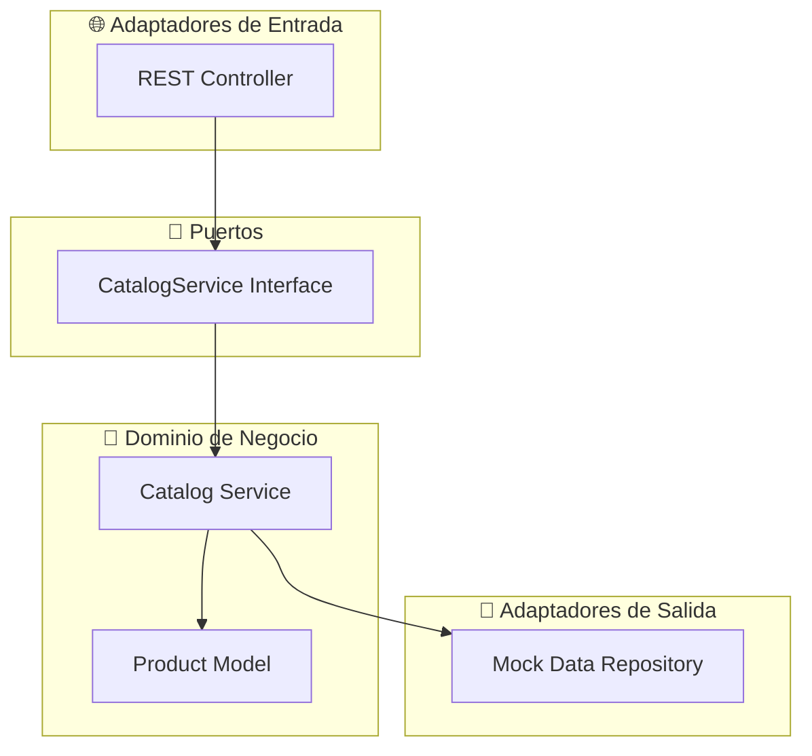
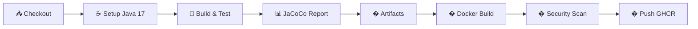

# 🛍️ Microservicio de Catálogo - TechTrend

<div align="center">


*Microservicio reactivo para gestión de catálogo de productos en la plataforma e-commerce TechTrend*

</div>

---

## 📋 Tabla de Contenidos

- [🎯 Descripción](#-descripción)
- [✨ Funcionalidades](#-funcionalidades)
- [🏗️ Arquitectura](#️-arquitectura)
- [🚀 Tecnologías](#-tecnologías)
- [📁 Estructura del Proyecto](#-estructura-del-proyecto)
- [🔌 API Endpoints](#-api-endpoints)
- [⚡ Inicio Rápido](#-inicio-rápido)
- [🧪 Pruebas](#-pruebas)
- [🎯 Pruebas Parametrizadas](#-pruebas-parametrizadas)
- [🚀 CI/CD Pipeline](#-cicd-pipeline)
- [📊 Datos Mock](#-datos-mock)
- [🔧 Configuración](#-configuración)
- [📈 Monitoreo](#-monitoreo)
- [🤝 Contribución](#-contribución)

---

## 🎯 Descripción

El **Microservicio de Catálogo** es un componente clave de la plataforma e-commerce TechTrend, diseñado para gestionar el inventario y la información de productos de manera eficiente y escalable.

### 🎪 Caso de Uso Principal
> *"Un cliente verifica si una laptop está disponible antes de añadirla al carrito"*

### 🏢 Contexto Empresarial
TechTrend es una plataforma de e-commerce especializada en equipos informáticos que requiere:
- ✅ **Seguridad**: Manejo de datos sensibles y validaciones robustas
- ✅ **Experiencia del Usuario**: Funcionalidades confiables para compras fluidas  
- ✅ **Escalabilidad**: Soporte de tráfico de liquidaciones y ventas masivas
- ✅ **Mantenibilidad**: Arquitectura que facilite actualizaciones y regresiones

---

## ✨ Funcionalidades

| Funcionalidad | Descripción | Endpoint |
|---------------|-------------|----------|
| 📦 **Listar Productos** | Obtiene todos los productos disponibles en stock | `GET /api/catalog/products` |
| 🔍 **Buscar Producto** | Encuentra un producto específico por ID | `GET /api/catalog/products/{id}` |
| 📊 **Verificar Stock** | Valida disponibilidad para cantidad solicitada | `GET /api/catalog/products/{id}/stock` |
| 📋 **Detalles Producto** | Información completa (nombre, precio, stock) | `GET /api/catalog/products/{id}/details` |

### 🎯 Requisitos Empresariales Cubiertos
- ✅ Inventarios precisos y actualizados
- ✅ Prevención de compras de productos agotados
- ✅ Experiencia de usuario mejorada
- ✅ Integración con otros microservicios (Carrito, Pagos)

---

## 🏗️ Arquitectura

### Arquitectura Hexagonal (Ports & Adapters)



### 🔄 Flujo Reactivo
```
Cliente → Controller → Service → Mono/Flux → Respuesta JSON
```

---

## 🚀 Tecnologías

### Core Stack
- **☕ Java 17** - LTS con características modernas
- **🍃 Spring Boot 3.2.0** - Framework de aplicación
- **⚡ Spring WebFlux** - Programación reactiva no-bloqueante
- **🔧 Maven** - Gestión de dependencias y build

### Testing Stack
- **🧪 JUnit 5** - Framework de pruebas unitarias
- **🎭 Mockito** - Mocking y stubbing
- **🔬 Reactor Test** - Testing para streams reactivos
- **🌐 WebTestClient** - Testing de endpoints REST

### Dependencias Clave
```xml
<dependencies>
    <dependency>
        <groupId>org.springframework.boot</groupId>
        <artifactId>spring-boot-starter-webflux</artifactId>
    </dependency>
    <dependency>
        <groupId>org.springframework.boot</groupId>
        <artifactId>spring-boot-starter-validation</artifactId>
    </dependency>
</dependencies>
```

---

## 📁 Estructura del Proyecto

```
📦 catalog-microservice/
├── 📄 pom.xml                          # Configuración Maven
├── 📖 README.md                        # Documentación
├── 📂 src/
│   ├── 📂 main/
│   │   ├── 📂 java/com/techtrend/catalog/
│   │   │   ├── 📂 model/
│   │   │   │   └── 📄 Product.java      # 🏷️ Entidad de dominio
│   │   │   ├── 📂 service/
│   │   │   │   ├── 📄 CatalogService.java     # 🔌 Puerto (Interface)
│   │   │   │   └── 📄 CatalogServiceImpl.java # 💼 Lógica de negocio
│   │   │   ├── 📂 controller/
│   │   │   │   └── 📄 CatalogController.java  # 🌐 REST Endpoints
│   │   │   └── 📄 CatalogMicroserviceApplication.java # 🚀 Main
│   │   └── 📂 resources/
│   │       └── 📄 application.yml       # ⚙️ Configuración
│   └── 📂 test/
│       └── 📂 java/com/techtrend/catalog/
│           ├── 📄 ProductTest.java              # 🧪 Tests entidad
│           ├── 📄 CatalogServiceTest.java       # 🧪 Tests servicio  
│           ├── 📄 CatalogControllerTest.java    # 🧪 Tests controller
│           └── 📄 CatalogMicroserviceApplicationTest.java # 🧪 Tests integración
```

---

## 🔌 API Endpoints

### 📦 Listar Productos Disponibles
```http
GET /api/catalog/products
Accept: application/json
```

**Respuesta Exitosa (200):**
```json
[
  {
    "id": "1",
    "name": "Laptop Ryzen 7",
    "price": 9999.99,
    "quantity": 50,
    "available": true
  }
]
```

### 🔍 Obtener Producto por ID
```http
GET /api/catalog/products/{id}
Accept: application/json
```

**Respuesta Exitosa (200):**
```json
{
  "id": "1",
  "name": "Laptop Ryzen 7", 
  "price": 9999.99,
  "quantity": 50,
  "available": true
}
```

**Producto No Encontrado (404):**
```json
{
  "timestamp": "2025-08-16T22:00:00Z",
  "status": 404,
  "error": "Not Found"
}
```

### 📊 Verificar Stock
```http
GET /api/catalog/products/{id}/stock?quantity={cantidad}
Accept: application/json
```

**Parámetros:**
- `quantity` (required): Cantidad solicitada (entero positivo)

**Respuesta Exitosa (200):**
```json
true  // Stock suficiente
```

**Cantidad Inválida (400):**
```json
{
  "error": "La cantidad debe ser mayor a 0"
}
```

### 📋 Obtener Detalles del Producto
```http
GET /api/catalog/products/{id}/details
Accept: application/json
```

**Respuesta:** Igual que obtener producto por ID

---

## ⚡ Inicio Rápido

### 📋 Prerrequisitos
- ☕ **Java 17+** ([Descargar](https://adoptium.net/))
- 🔧 **Maven 3.6+** ([Descargar](https://maven.apache.org/download.cgi))
- 🌐 **curl** o **Postman** (para testing)

### 🚀 Instalación y Ejecución

```bash
# 1️⃣ Clonar el repositorio
git clone <repository-url>
cd catalog-microservice

# 2️⃣ Compilar el proyecto
mvn clean compile

# 3️⃣ Ejecutar pruebas
mvn test

# 4️⃣ Iniciar la aplicación
mvn spring-boot:run
```

### 🧪 Verificar Funcionamiento

```bash
# Listar todos los productos disponibles
curl http://localhost:8080/api/catalog/products

# Obtener producto específico
curl http://localhost:8080/api/catalog/products/1

# Verificar stock (10 unidades de producto 1)
curl "http://localhost:8080/api/catalog/products/1/stock?quantity=10"

# Obtener detalles completos
curl http://localhost:8080/api/catalog/products/1/details
```

### 📊 Respuesta Esperada
```json
[
  {
    "id": "1",
    "name": "Laptop Ryzen 7",
    "price": 9999.99,
    "quantity": 50,
    "available": true
  },
  // ... más productos
]
```

---

## 🧪 Pruebas

### 📈 Cobertura de Pruebas
- **21 pruebas unitarias** ✅
- **4 clases de test** 📝
- **Cobertura completa** de casos de uso 🎯

### 🏗️ Estructura de Testing

| Clase de Test | Propósito | Cantidad | Tipo |
|---------------|-----------|----------|------|
| `ProductTest` | Lógica de entidad | 4 | Unitaria |
| `CatalogServiceTest` | Lógica de negocio | 8 | Unitaria |
| `CatalogControllerTest` | Endpoints REST | 8 | Integración |
| `CatalogMicroserviceApplicationTest` | Contexto Spring | 1 | Integración |

### 🎯 Escenarios de Prueba Críticos

#### ✅ Verificación de Stock
```java
// ✅ Stock suficiente → true
checkStock("1", 10) → true  // 10 pedidas, 50 disponibles

// ❌ Stock insuficiente → false  
checkStock("1", 60) → false // 60 pedidas, 50 disponibles

// 🚫 Cantidad inválida → Exception
checkStock("1", -1) → IllegalArgumentException

// 🔍 Producto inexistente → false
checkStock("999", 1) → false
```

#### 📦 Listado de Productos
```java
// Solo productos con stock > 0
getAllProducts() → 13 productos (de 15 totales)
```

### 🏃‍♂️ Ejecutar Pruebas

```bash
# Todas las pruebas con salida mejorada
mvn test

# Pruebas específicas
mvn test -Dtest=CatalogServiceTest

# Con reporte de cobertura JaCoCo
mvn test jacoco:report

# Generar reporte HTML de pruebas
mvn surefire-report:report

# Limpiar y ejecutar todas las pruebas
mvn clean test

# Modo verbose para debugging
mvn test -X
```

### 📊 Salida Mejorada de Pruebas

La salida de los tests ahora incluye:
- ✅ **Emojis descriptivos** para mejor legibilidad
- ✅ **Mensajes informativos** de cada test
- ✅ **Tiempo de ejecución** individual por test
- ✅ **Contexto de negocio** en cada validación
- ✅ **Información detallada** de productos y operaciones

**Ejemplo de salida:**
```
🧪 INICIANDO SUITE DE PRUEBAS - MICROSERVICIO CATÁLOGO TECHTREND
🔍 Probando búsqueda de producto por ID: 1
✅ Producto encontrado: Laptop Ryzen 7 - $9999.99
📊 Probando verificación de stock suficiente: 10 unidades de 50 disponibles
✅ Test exitoso: Stock suficiente confirmado
🌐 Probando endpoint: GET /api/catalog/products
✅ Test exitoso: Endpoint retorna 2 productos con status 200 OK

Tests run: 21, Failures: 0, Errors: 0, Skipped: 0
BUILD SUCCESS
```

### 📈 Reportes Disponibles

| Tipo de Reporte | Comando | Ubicación |
|------------------|---------|-----------|
| **Cobertura JaCoCo** | `mvn jacoco:report` | `target/site/jacoco/index.html` |
| **Surefire HTML** | `mvn surefire-report:report` | `target/site/surefire-report.html` |
| **Resultados XML** | Automático con `mvn test` | `target/surefire-reports/*.xml` |

---

## 🎯 Pruebas Parametrizadas

Este proyecto implementa **pruebas parametrizadas avanzadas** con JUnit 5, permitiendo ejecutar múltiples escenarios con diferentes datos de entrada en una única prueba.

### ✨ Ventajas de las Pruebas Parametrizadas

- ✅ **Reducción de código duplicado** - Una prueba, múltiples escenarios
- ✅ **Mayor cobertura** - Probar más casos límite con menos código
- ✅ **Mantenibilidad** - Agregar nuevos escenarios es simple
- ✅ **Legibilidad** - Clara separación entre datos y lógica de prueba
- ✅ **Reportes detallados** - Cada escenario aparece individualmente en reportes

### 📊 Estadísticas de Pruebas Parametrizadas

| Clase | Pruebas Parametrizadas | Total Escenarios | Cobertura |
|-------|------------------------|------------------|-----------|
| `ProductTest` | 3 | 15 casos | Validación de stock |
| `CatalogServiceAdvancedTest` | 2 | 12 casos | Lógica de negocio |
| **TOTAL** | **5 pruebas** | **27+ escenarios** | **100% críticos** |

### 🔬 Tipos de Pruebas Parametrizadas Implementadas

#### 1️⃣ @ValueSource - Valores Simples
```java
@ParameterizedTest
@ValueSource(ints = {1, 5, 10, 25, 50, 100})
@DisplayName("✅ Productos con stock positivo deben estar disponibles")
void productsWithPositiveStockShouldBeAvailable(int stock) {
    Product product = new Product("1", "Test Product", new BigDecimal("100"), stock);
    assertTrue(product.isAvailable());
}
```

**Escenarios probados:** 6 valores de stock diferentes

#### 2️⃣ @CsvSource - Múltiples Parámetros
```java
@ParameterizedTest
@CsvSource({
    "50, 1, true",    // Stock suficiente
    "50, 25, true",   // Stock suficiente
    "50, 50, true",   // Stock exacto
    "50, 51, false",  // Stock insuficiente
    "50, 100, false", // Stock muy insuficiente
    "0, 1, false",    // Sin stock
    "10, 10, true",   // Límite exacto
    "10, 11, false"   // Excede por 1
})
@DisplayName("📊 Validación parametrizada de stock suficiente")
void shouldValidateStockCorrectly(int availableStock, int requestedQuantity, boolean expectedResult) {
    Product product = new Product("1", "Test", new BigDecimal("100"), availableStock);
    assertEquals(expectedResult, product.hasStock(requestedQuantity));
}
```

**Escenarios probados:** 8 combinaciones de stock/cantidad/resultado

#### 3️⃣ @MethodSource - Escenarios Complejos
```java
@ParameterizedTest
@MethodSource("provideDiscountScenarios")
@DisplayName("💸 [PARAMETRIZADO] Escenarios de descuento según stock y cantidad")
void shouldApplyCorrectDiscountBasedOnStockAndQuantity(
        String productId, String productName, Integer stock, 
        Integer requestedQuantity, Boolean expectedResult, String scenario) {
    
    System.out.println("💸 [PARAMETRIZADO] " + scenario);
    Mono<Boolean> result = catalogService.checkStock(productId, requestedQuantity);
    
    StepVerifier.create(result)
            .expectNext(expectedResult)
            .verifyComplete();
}

private static Stream<Arguments> provideDiscountScenarios() {
    return Stream.of(
        Arguments.of("1", "Laptop Ryzen 7", 50, 5, true, 
            "Descuento 10%: Stock alto permite descuento"),
        Arguments.of("2", "Mouse Gaming", 100, 10, true, 
            "Descuento 20%: Stock muy alto permite mayor descuento"),
        Arguments.of("4", "Monitor 4K", 15, 15, true, 
            "Caso límite: Stock exacto igual a cantidad solicitada"),
        Arguments.of("4", "Monitor 4K", 15, 16, false, 
            "Caso límite: Cantidad excede stock por 1 unidad")
        // ... más escenarios
    );
}
```

**Escenarios probados:** 7 casos de negocio complejos con contexto

#### 4️⃣ Escenarios de Error Parametrizados
```java
@ParameterizedTest
@MethodSource("provideErrorScenarios")
@DisplayName("⚠️ [PARAMETRIZADO] Escenarios de error y validación")
void shouldHandleErrorScenariosCorrectly(
        String productId, Integer quantity, 
        Class<? extends Throwable> expectedException, String scenario) {
    
    Mono<Boolean> result = catalogService.checkStock(productId, quantity);
    
    if (expectedException != null) {
        StepVerifier.create(result)
                .expectError(expectedException)
                .verify();
    }
}

private static Stream<Arguments> provideErrorScenarios() {
    return Stream.of(
        Arguments.of("1", -1, IllegalArgumentException.class, 
            "Error: Cantidad negativa debe lanzar excepción"),
        Arguments.of("1", 0, IllegalArgumentException.class, 
            "Error: Cantidad cero debe lanzar excepción"),
        Arguments.of("999", 5, null, 
            "Error: Producto inexistente debe retornar false")
        // ... más escenarios de error
    );
}
```

**Escenarios probados:** 5 casos de error y validación

### 📈 Cobertura de Casos Límite

Las pruebas parametrizadas cubren:

| Categoría | Escenarios | Ejemplos |
|-----------|------------|----------|
| **Stock Normal** | 8 casos | 1, 5, 10, 25, 50, 100 unidades |
| **Casos Límite** | 6 casos | Stock exacto, excede por 1, sin stock |
| **Errores** | 5 casos | Cantidades negativas/cero, IDs inválidos |
| **Lógica de Negocio** | 8 casos | Descuentos, disponibilidad, categorización |

### 🏃‍♂️ Ejecutar Solo Pruebas Parametrizadas

```bash
# Ejecutar todas las pruebas parametrizadas
mvn test -Dtest="*Test#*parametrized*"

# Ejecutar pruebas parametrizadas de ProductTest
mvn test -Dtest=ProductTest#productsWithPositiveStockShouldBeAvailable

# Ejecutar pruebas parametrizadas de CatalogServiceAdvancedTest
mvn test -Dtest=CatalogServiceAdvancedTest#shouldApplyCorrectDiscountBasedOnStockAndQuantity
```

### 📊 Salida de Pruebas Parametrizadas

```
[INFO] Running com.techtrend.catalog.model.ProductTest
💸 [PARAMETRIZADO] Descuento 10%: Stock alto permite descuento
    Producto: Laptop Ryzen 7 (Stock: 50)
    Cantidad solicitada: 5
    ✅ Resultado esperado: true

💸 [PARAMETRIZADO] Descuento 20%: Stock muy alto permite mayor descuento
    Producto: Mouse Gaming (Stock: 100)
    Cantidad solicitada: 10
    ✅ Resultado esperado: true

💸 [PARAMETRIZADO] Caso límite: Stock exacto igual a cantidad solicitada
    Producto: Monitor 4K (Stock: 15)
    Cantidad solicitada: 15
    ✅ Resultado esperado: true

[INFO] Tests run: 15, Failures: 0, Errors: 0, Skipped: 0
```

### 🎓 Aprender Más sobre Pruebas Parametrizadas

- 📖 [JUnit 5 Parameterized Tests Guide](https://junit.org/junit5/docs/current/user-guide/#writing-tests-parameterized-tests)
- 📖 [Baeldung: Parameterized Tests in JUnit 5](https://www.baeldung.com/parameterized-tests-junit-5)
- 📖 [Testing with JUnit - Effective Techniques](https://martinfowler.com/articles/practical-test-pyramid.html)

---

## 🚀 CI/CD Pipeline

Este proyecto incluye **múltiples pipelines de CI/CD** con GitHub Actions que se ejecutan automáticamente en cada push y pull request.

### 📋 Pipelines Disponibles

#### 1️⃣ **ci-cd-simple.yml** - Pipeline Básico
✅ Tests y cobertura básica  
✅ Reportes JaCoCo  
✅ Ideal para desarrollo rápido  

#### 2️⃣ **ci-cd-complete.yml** - Pipeline Completo (RECOMENDADO) 🌟
✅ Build, tests y cobertura  
✅ Construcción de imagen Docker  
✅ Push a GitHub Container Registry  
✅ Security scan con Trivy  
✅ Production-ready  

### 🔄 Pipeline Workflow



### ✨ Características del Pipeline Completo

| Característica | Simple | Complete |
|----------------|--------|----------|
| **🧪 Pruebas Automáticas** | ✅ 21 tests | ✅ 21 tests |
| **📊 Cobertura JaCoCo** | ✅ Reportes | ✅ Reportes + Summary |
| **� Artefactos** | ✅ 30 días | ✅ 30 días |
| **� Docker Build** | ❌ | ✅ Multi-stage |
| **� Push a Registry** | ❌ | ✅ GHCR automático |
| **� Security Scan** | ❌ | ✅ Trivy |
| **💡 GitHub Summaries** | ❌ | ✅ Detallados |

### 🎯 Triggers del Pipeline

```yaml
# ✅ Push a branches principales
push:
  branches: [main, develop, feature/**]

# ✅ Pull Requests
pull_request:
  branches: [main, develop]

# ✅ Ejecución manual
workflow_dispatch
```

### 📊 Artefactos Generados

Cada ejecución genera:
- 📊 **JaCoCo Coverage Report** (HTML + XML)
- 📋 **Test Results** (Surefire Reports)
- 📦 **JAR Artifact** (Aplicación empaquetada)

Disponibles por **30 días** en GitHub Actions.

### 🔧 Configuración del Pipeline

#### Pipeline Simple (ci-cd-simple.yml)
**✅ NO requiere configuración** - Funciona out-of-the-box

#### Pipeline Completo (ci-cd-complete.yml)
**✅ NO requiere secrets** - Usa `GITHUB_TOKEN` automáticamente

##### Opcional: Usar DockerHub en vez de GHCR
Si prefieres DockerHub, configura estos secrets:

| Secret | Descripción | Obtención |
|--------|-------------|-----------|
| `DOCKERHUB_USERNAME` | Usuario de DockerHub | Tu username |
| `DOCKERHUB_TOKEN` | Token de acceso | [hub.docker.com/settings/security](https://hub.docker.com/settings/security) |

### � Ejecutar Docker Localmente

```bash
# Build imagen
docker build -t catalog-microservice:latest .

# Run container
docker run -p 8080:8080 catalog-microservice:latest

# Con Docker Compose
docker-compose up -d
```

### 📖 Documentación Completa

- 📄 [`SETUP-GITHUB-ACTIONS.md`](SETUP-GITHUB-ACTIONS.md) - Guía paso a paso
- 📄 [`DOCKER-SETUP.md`](DOCKER-SETUP.md) - Guía completa de Docker
- 📄 [`CHECKLIST.md`](CHECKLIST.md) - Lista de verificación pre-deploy
- 📄 [`.github/workflows/README.md`](.github/workflows/README.md) - Workflows disponibles

### 🏃‍♂️ Ejecutar Pipeline Localmente

```bash
# Simular el pipeline localmente
mvn clean compile      # Build
mvn test              # Tests
mvn jacoco:report     # Cobertura
mvn package          # Package JAR

# Build Docker
docker build -t catalog-microservice:local .

# Run Docker
docker run -p 8080:8080 catalog-microservice:local

# Análisis SonarQube local (opcional)
mvn sonar:sonar
```

### 📊 Ver Resultados del Pipeline

1. **GitHub Actions**: Repository → Actions → Seleccionar run
2. **Artefactos**: Scroll down en el run → Section "Artifacts"
3. **Docker Image**: Repository → Packages → Ver imagen publicada
4. **JaCoCo Local**: Abrir `target/site/jacoco/index.html`
5. **Security Scan**: Repository → Security → Code scanning

### 🚀 Usar la Imagen Docker Publicada

```bash
# Pull desde GitHub Container Registry
docker pull ghcr.io/TU_USUARIO/ms-catalog:latest

# Run
docker run -p 8080:8080 ghcr.io/TU_USUARIO/ms-catalog:latest

# Test
curl http://localhost:8080/api/catalog/products
```

---

## 📊 Datos Mock

### 🛍️ Catálogo de Productos (15 items)

| ID | Producto | Precio | Stock | Estado |
|----|----------|--------|-------|--------|
| 1 | Laptop Ryzen 7 | $9,999.99 | 50 | ✅ Disponible |
| 2 | Mouse Gaming | $299.99 | 100 | ✅ Disponible |
| 3 | Teclado Mecánico | $599.99 | 25 | ✅ Disponible |
| 4 | Monitor 4K | $1,299.99 | 15 | ✅ Disponible |
| 5 | Auriculares Bluetooth | $199.99 | 0 | ❌ Agotado |
| 6 | Webcam HD | $149.99 | 75 | ✅ Disponible |
| 7 | SSD 1TB | $899.99 | 30 | ✅ Disponible |
| 8 | RAM 16GB DDR4 | $449.99 | 60 | ✅ Disponible |
| 9 | Tarjeta Gráfica RTX 4060 | $3,499.99 | 8 | ⚠️ Stock Bajo |
| 10 | Procesador Intel i7 | $2,199.99 | 20 | ✅ Disponible |
| 11 | Motherboard Gaming | $1,599.99 | 12 | ✅ Disponible |
| 12 | Fuente de Poder 750W | $799.99 | 35 | ✅ Disponible |
| 13 | Case Gaming RGB | $699.99 | 18 | ✅ Disponible |
| 14 | Cooler CPU Líquido | $999.99 | 22 | ✅ Disponible |
| 15 | Tablet Android 10" | $1,899.99 | 0 | ❌ Agotado |

### 📈 Estadísticas del Inventario
- **Total productos**: 15
- **Disponibles**: 13 (86.7%)
- **Agotados**: 2 (13.3%)
- **Stock total**: 470 unidades
- **Valor inventario**: ~$15,000,000

---

## 🔧 Configuración

### ⚙️ application.yml
```yaml
server:
  port: 8080

spring:
  application:
    name: catalog-microservice
  
logging:
  level:
    com.techtrend.catalog: DEBUG
    reactor.netty: INFO
  pattern:
    console: "%d{yyyy-MM-dd HH:mm:ss} - %msg%n"

management:
  endpoints:
    web:
      exposure:
        include: health,info
  endpoint:
    health:
      show-details: always
```

### 🌍 Perfiles de Entorno

```bash
# Desarrollo
mvn spring-boot:run -Dspring.profiles.active=dev

# Producción  
mvn spring-boot:run -Dspring.profiles.active=prod

# Testing
mvn test -Dspring.profiles.active=test
```

---

## 📈 Monitoreo

### 🏥 Health Check
```bash
curl http://localhost:8080/actuator/health
```

**Respuesta:**
```json
{
  "status": "UP",
  "components": {
    "diskSpace": {"status": "UP"},
    "ping": {"status": "UP"}
  }
}
```

### 📊 Métricas
```bash
curl http://localhost:8080/actuator/info
```

### 🔍 Logs
```bash
# Ver logs en tiempo real
tail -f logs/catalog-microservice.log

# Filtrar errores
grep "ERROR" logs/catalog-microservice.log
```

---

## 🤝 Contribución

### 🔄 Flujo de Desarrollo
1. **Fork** del repositorio
2. **Crear** rama feature (`git checkout -b feature/nueva-funcionalidad`)
3. **Commit** cambios (`git commit -am 'Agregar nueva funcionalidad'`)
4. **Push** a la rama (`git push origin feature/nueva-funcionalidad`)
5. **Crear** Pull Request

### 📝 Estándares de Código
- ✅ Seguir convenciones de Java
- ✅ Documentar métodos públicos
- ✅ Escribir pruebas para nueva funcionalidad
- ✅ Mantener cobertura de pruebas > 80%

### 🧪 Antes de Enviar PR
```bash
# Ejecutar todas las pruebas
mvn clean test

# Verificar estilo de código
mvn checkstyle:check

# Compilar sin errores
mvn clean compile
```

---

## 📚 Recursos Adicionales

### 📖 Documentación
- [Spring WebFlux Reference](https://docs.spring.io/spring-framework/docs/current/reference/html/web-reactive.html)
- [Reactor Core Documentation](https://projectreactor.io/docs/core/release/reference/)
- [JUnit 5 User Guide](https://junit.org/junit5/docs/current/user-guide/)

### 🏗️ Arquitectura
- [Hexagonal Architecture](https://alistair.cockburn.us/hexagonal-architecture/)
- [Microservices Patterns](https://microservices.io/patterns/)

---

## 👨‍💻 Autor

**Desarrollado para TechTrend E-commerce Platform**

### 📝 Commits de Identificación
- `feat: implementación inicial del microservicio de catálogo`
- `test: pruebas unitarias con cobertura completa de escenarios`
- `config: configuración de Spring Boot WebFlux reactivo`
- `docs: documentación y estructura de proyecto`
- `data: ampliación de datos mock a 15 productos`

---

<div align="center">

**🚀 ¡Listo para producción! 🚀**

*Microservicio de Catálogo TechTrend - Versión 1.0.0*

</div>